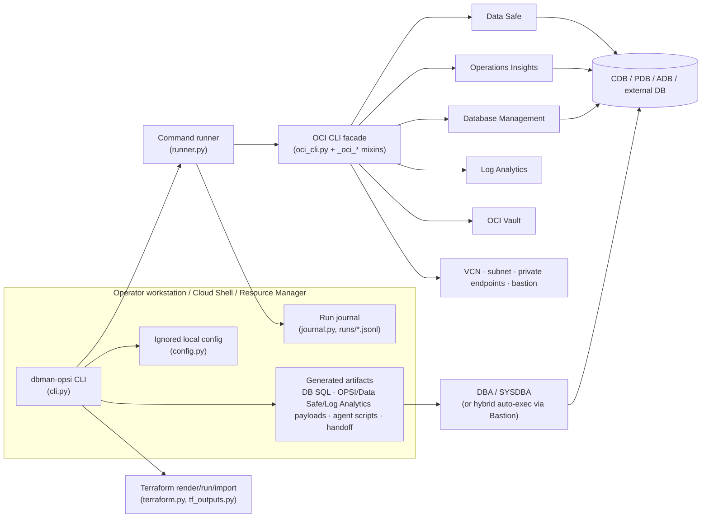
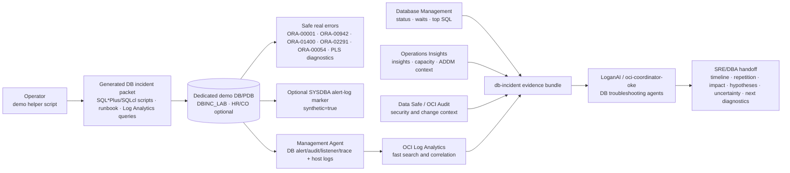
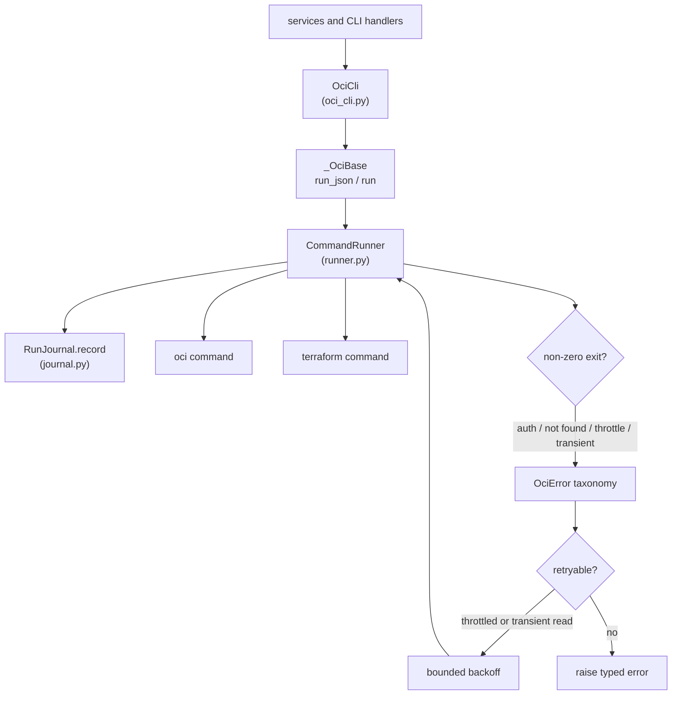
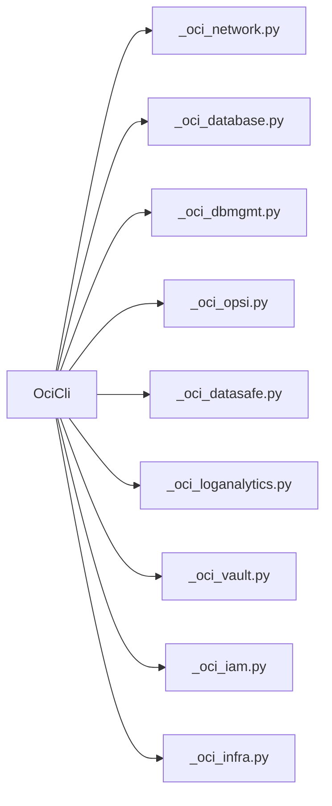
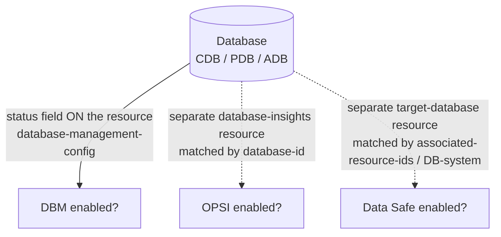
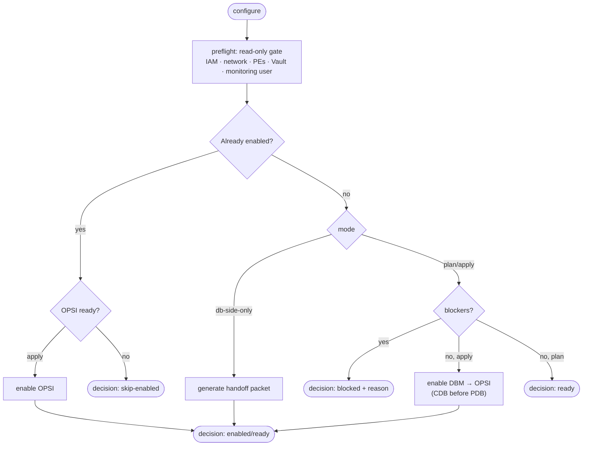
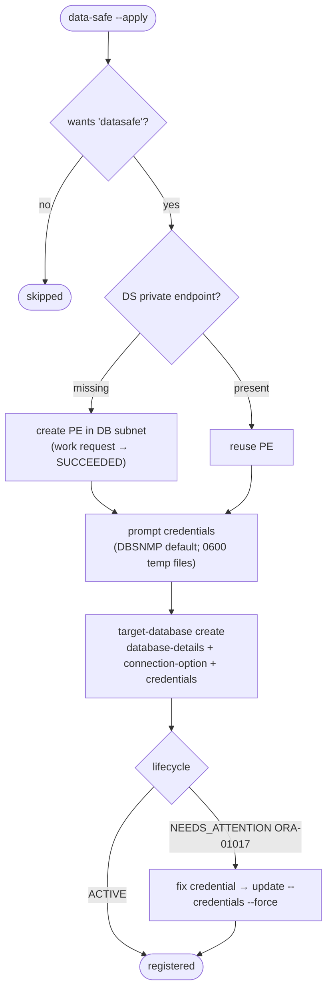
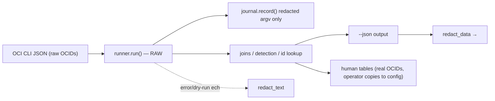
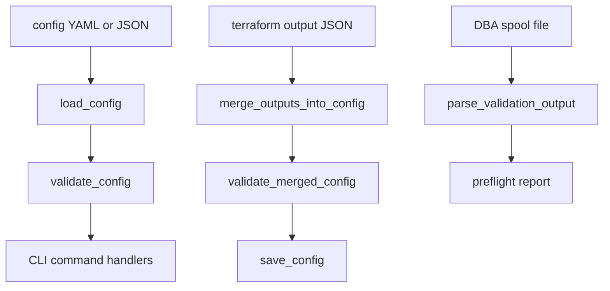
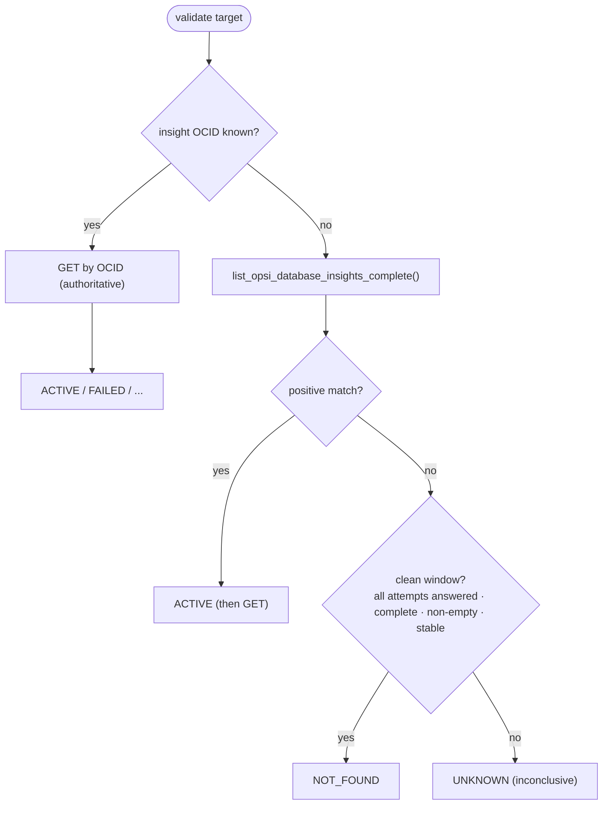

# Architecture

Owning product requirements: [Disposable Database Lifecycle](product/prd-disposable-db-lifecycle.md), [Vault Credential Lifecycle](product/prd-vault-credential-lifecycle.md), and [Observability 360](product/prd-observability-360.md).

`dbman-opsi` enables four OCI observability/security pillars for Oracle
databases — **Database Management (DBM)**, **Operations Insights (OPSI)**, and
**Data Safe**, plus the optional **Log Analytics** add-on — across Base Database
/ DBCS, Autonomous Database, Exadata, and external databases. It is a thin, testable orchestration layer over the OCI CLI
and Terraform: discover what exists, gate on prerequisites, then enable (live) or
hand off DB-side steps to a DBA.

This document maps the system, its control/data boundaries, and the verdict and
redaction models that make it safe to run against production tenancies.

## System view



## DB incident troubleshooting workflow

The DB incident demo adds a troubleshooting workflow on top of the same pillars.
It is demo-only and uses a disposable lab schema plus optional synthetic alert-log
markers for internal-error context; it does not try to force Oracle internal
errors.



The key boundary is intentional: **Log Analytics is the ingestion/search layer**,
while AI agents are the contextual reasoning layer. A final answer should never
stop at “ORA-00600 found”; it must state when it happened, what preceded it,
whether it repeated, which sources were present or missing, likely impact,
confidence, uncertainty, evidence to collect, and next actions.

## Module map

| Layer | Modules | Responsibility |
| --- | --- | --- |
| UX / entry | `cli.py`, `wizard.py`, `reporting.py`, `doctor.py` | Commands, interactive planning, human/JSON output, environment checks, run-journal inspection |
| Config | `config.py`, `redact.py` | Immutable `EnablementConfig`/`Target`, YAML/JSON round-trip, boundary validation, display redaction |
| Discover / gate | `discovery.py`, `preflight.py`, `checks.py`, `prerequisites.py`, `db_check.py`, `status.py`, `conn.py`, `oci_util.py` | Read-only inventory, pillar detection, connection-string parsing, best-effort lookups, prerequisite and DB-spool gating |
| Act | `orchestrator.py`, `enablement.py`, `datasafe.py`, `log_analytics.py`, `iam.py`, `credentials.py`, `db_exec.py` | Detect→branch→gate→enable/handoff; DBM/OPSI/Data Safe/Log Analytics enablement; hybrid DB-side execution |
| Generate | `db_scripts.py`, `opsi_payloads.py`, `log_analytics.py`, `agent_scripts.py`, `handoff.py` | DB-side SQL, OPSI/Data Safe/Log Analytics payloads, agent bootstrap, DBA handoff packets |
| Execute | `runner.py`, `journal.py`, `oci_cli.py`, `_oci_base.py`, `_oci_network.py`, `_oci_database.py`, `_oci_dbmgmt.py`, `_oci_opsi.py`, `_oci_datasafe.py`, `_oci_loganalytics.py`, `_oci_vault.py`, `_oci_iam.py`, `_oci_infra.py`, `terraform.py`, `tf_outputs.py` | Subprocess choke point, redacted run journal, OCI CLI facade composed from per-domain mixins, Terraform render/run/import |

## Demo-only Data Safe export bridge

The repo also carries a demo-only operator bridge for **Data Safe audit export**
into OCI Logging and Log Analytics:

- script: `scripts/demo-datasafe-log-export.sh`
- doc: `docs/datasafe-log-analytics.md`
- assets: `generated/datasafe-observability/`

This path is intentionally separate from the core `data-safe --apply` target
registration flow. Registration answers *which* databases are monitored by Data
Safe; the export bridge answers *how* recent audit events become searchable in
OCI Logging / Log Analytics for the demo dashboards and AI drilldowns.

| Validate | `validation.py`, `remediation.py` | Post-enable verdicts and remediation hints |

## OCI CLI facade and runner choke point

`OciCli` is a flat client assembled from small per-domain mixins. Shared behavior
(`run_json`, `run`, response unwrapping, profile tenancy lookup) lives in
`_oci_base.py`; domain modules hold only their OCI command surface. Every OCI and
Terraform subprocess crosses `CommandRunner`, which is also where command timing,
redacted journaling, `OciError` classification, and retry/backoff are applied.



The mixin split is organizational only; callers still use one `OciCli` object:



## The service pillars

The pillars are detected three different ways — a key design point that drives the
discovery layer:



- **DBM** status lives *on* the database resource.
- **OPSI** is a separate `database-insights` resource joined back by `database-id`.
- **Data Safe** is a separate `target-database` resource joined by
  `associated-resource-ids` (the LIST summary's `database-details` is null). A
  Base DB target registered with a PDB service name associates at the **DB-system**
  grain, so Data Safe is attributed at the CDB/DB-system level.
- **Log Analytics** uses Management Agent collection and source/entity
  associations. Terraform carries namespace/log-group/entity IDs and IAM intent,
  while source association payloads and ADB TCPS credential templates are
  generated and applied by the CLI so install keys, wallets, DB passwords, and
  credential JSON stay out of Terraform state.

`discovery.py` pre-fetches the OPSI and Data Safe collections **once per
compartment** and fans them in by OCID (avoids an N+1 lookup per database).

## Command lifecycle (`configure`)



CDB/PDB ordering: PDB targets carry `parent_cdb_id`; the orchestrator enables the
container database first and clears the PDB's `target.parent_cdb` blocker in-run.

## Fleet lifecycle boundary

The fleet commands (`onboard`, `resume`, `fleet-status`, and `offboard`) add a
separate, plan-gated layer over the established expert commands. Discovery reads
all subscribed regions and accessible compartments, records any failed scope, and
does not turn a partial inventory into a complete plan. The immutable plan hash is
the required write approval; state is local SQLite with mode `0600`, optionally
mirrored through an Object Storage backend that verifies checksum/run/plan/schema on
download and uses ETag `if-match` or create-only upload semantics. Status and
retained evidence are sanitized, whereas the private state remains local to the
approved operator boundary.

The executor has bounded fleet concurrency (1--8 from answer files), per-service
serialization by default, jittered retry for transient errors, and an authorization
circuit breaker. It checkpoints every phase, continues unrelated targets, blocks
dependent PDB work after a CDB failure, and produces a signed handoff rather than
inventing DB/host success. Cleanup is a separate exact-plan operation: Log
Analytics, OPSI, PDB DBM, and CDB DBM are reversed before run-created credentials,
endpoints, networks, and optional disposable test databases. Reused and preexisting
resources are untouched; production never deletes databases. See the
[fleet lifecycle runbook](fleet-lifecycle-runbook.md) for operator commands and
live acceptance evidence requirements.

## Data Safe enablement flow



## Hybrid DB-side execution

```mermaid
flowchart LR
  Plan([db-exec / configure]) --> Gate{profile in PROD_PROFILES?}
  Gate -->|no (demo/test)| Auto["auto-run via Bastion<br/>01→02→03→05→06→04"]
  Gate -->|yes (production)| HO["generate-and-handoff<br/>HANDOFF.md for the DBA"]
```

DB-side SQL is never auto-executed in production. The tenancy gate lives in the
executor (`db_exec.py`), keeping SQL generation pure.

## Control-plane vs data-plane / read-live vs write-gated

- **Reads are always live.** `validate`, `preflight`, `configure` reads, and
  `discover` build their OCI CLI with `CommandRunner(dry_run=False)` — a dry-run
  runner stubs every read to `{}`, which would look identical to a missing
  resource. Writes respect `--apply`/`dry_run`.
- **Boundary validation is explicit.** Config loading calls `validate_config()`;
  Terraform output import calls `merge_outputs_into_config()` and then
  `validate_merged_config()` before writing; `preflight --db-check-file` parses
  the DBA-spooled `04-validate-monitoring-user.sql` output through `db_check.py`.
- **Redaction is a display concern, applied at the boundary** — never in the data
  path. `runner.run()` returns **raw** stdout so OCID-keyed joins work;
  redaction happens in `--json` output (`redact_data`) and `config.sanitized()`.
  Human `discover` output intentionally prints real OCIDs so operators can copy
  them into config (their own tenancy). Error messages and the dry-run echo stay
  redacted.





## Validation verdict model (OPSI)

The aggregated `database-insights list` control plane flaps (0/2/7 items
call-to-call), so absence can never be concluded from a single list:



A positive match is authoritative; `NOT_FOUND` is emitted only from a complete,
non-empty, stable window; everything else is `UNKNOWN`.

## Testing

- `pytest` enforces ≥80% coverage (`pyproject.toml`).
- Eval-first regression suite under `tests/evals/` — see
  [tests/evals/README.md](../tests/evals/README.md) — organizes capability and
  regression evals by defect signature (e.g. the OPSI flap, the `validate
  --dry-run` stub bug) so each fixed defect stays fixed.

## Live runbook & knowledge base

- End-to-end live flow with every defect found and fixed:
  [demo-db-incident-e2e.md](demo-db-incident-e2e.md).
- Failure-signature → root-cause → fix: [../KB.md](../KB.md).
