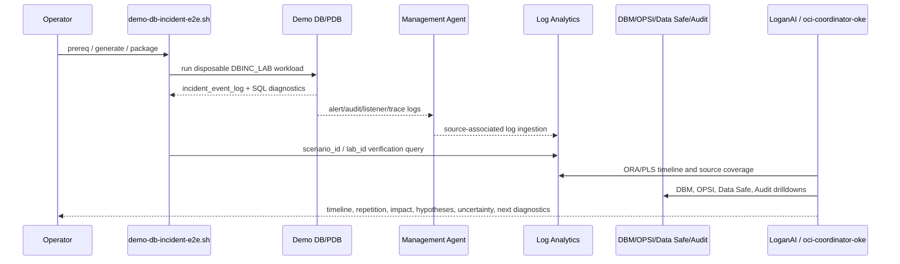

# DB Incident Demo End-To-End Runbook

Owning product requirement: [Demo Orchestration](product/prd-demo-orchestration.md).

This runbook defines the prerequisites and task sequence for running the DB incident demo against a dedicated demo database, collecting real database logs into OCI Log Analytics, and troubleshooting them with LoganAI and `oci-coordinator-oke` agents.

For the broader wiki-style guide that explains the product capabilities, component
deep dives, and the larger lab flow around this runbook, see
[docs/wiki-oci-db-observability-lab.md](wiki-oci-db-observability-lab.md).

This is not for production use. Use a dedicated demo DB or disposable PDB only. Do not commit tenancy names, OCIDs, IP addresses, hostnames, wallet paths, passwords, or private connect strings; keep them in ignored local config or environment variables.

## Provisioning wait and next steps

Creating a DBCS is asynchronous and commonly takes tens of minutes. After
Terraform submits the database-system request, do not retry `apply` just because
the CLI invocation returns before the service is ready. Monitor the existing
request instead:

```bash
scripts/demo-db-incident-e2e.sh wait-db
```

The command uses color-coded `INFO`, `WARN`, `FAIL`, and `OK` messages: it polls
until the database is `AVAILABLE`, stops on a terminal failure, and prints the
next actions. Once available, import Terraform outputs into the ignored local
config, generate the dedicated-user/dashboard assets, store role passwords in
Vault, then run the approved DB bootstrap and four-pillar enablement flows.

## Console recovery fallback

If an OCI Bastion port-forward session cannot be established, use the disposable
jump host's serial console as a recovery path. It creates an ephemeral RSA key
and an OCI Instance Console Connection for one invocation; it does not store
the key or connection metadata in the repository. Export the same
`LIFECYCLE_ID` used by the deployment: the helper requires the matching tag and
deletes the temporary console connection when the SSH session exits.

```bash
export COMPARTMENT_ID='<DEMO_COMPARTMENT_OCID>'
scripts/open-disposable-console.sh
```

This is for the disposable PoC jump host only, not a production access pattern.

## Goal

Generate safe, real Oracle errors in the demo DB, collect database alert/audit/listener/host logs through OCI Log Analytics, and use AI agents as the reasoning layer:

1. Log Analytics ingests and searches real DB/host logs.
2. DB Management contributes managed database context, status, waits, and top SQL drilldowns.
3. OPSI contributes database insight, capacity, SQL insight, and ADDM context.
4. Data Safe contributes security/audit target context when registered.
5. `oci-coordinator-oke` calls `oci_logan_build_db_incident_evidence`, then drills into DBM, OPSI, Audit, and Data Safe.
6. The final answer distinguishes direct ORA evidence from inventory/context signals.



## Prerequisites

Local operator machine:

- OCI CLI authenticated with `PROFILE`/`OCI_PROFILE` and `REGION`/`OCI_REGION`.
  When `CONFIG` is supplied, the runner derives missing values from it and stops
  before an OCI mutation if `REGION` differs from the target's configured region.
- This repo checkout, run with `PYTHONPATH=src` so new local commands are used.
- `scripts/demo-db-incident-e2e.sh` executable.
- An ignored `CONFIG`/`DBMAN_OPSI_CONFIG` file for the demo tenancy.
- No secrets, OCIDs, IPs, hostnames, or tenant names committed.

Demo execution host:

- Use either an OCI Bastion resource or an approved demo jumphost.
- SSH key for the chosen path.
- `sqlplus` or SQLcl installed on the DB host or jumphost.
- SQLcl requires Java 11 or later. The packet automatically chooses an approved
  Java 11+ installation from `DB_INCIDENT_JAVA_HOME`, `JAVA_HOME`, or common
  Oracle Linux locations; set `DB_INCIDENT_JAVA_HOME` explicitly when the host
  defaults to an older Java runtime.
- Network path from execution host to demo DB listener.
- `DB_INCIDENT_ADMIN_CONNECT` points only to the demo DB/PDB.
- `DB_INCIDENT_LAB_PASSWORD` is a disposable password for `DBINC_LAB`.
- If SQLcl is not already installed on the execution host, provide either a
  reviewed local `DB_INCIDENT_SQLCL_ARCHIVE` or reviewed HTTPS
  `DB_INCIDENT_SQLCL_URL`, together with its exact `DB_INCIDENT_SQLCL_SHA256`.
  The packet refuses unverified or moving “latest” downloads.

Log Analytics:

- Namespace onboarded.
- Demo log group exists.
- Management Agent with Log Analytics plugin installed on the DB host or collector host.
- Log Analytics database entity exists for the demo DB.
- Log Analytics host entity exists for the DB host.
- Source associations exist for database alert/audit/listener/trace logs and Linux host logs.
- DB-side ACLs allow the Management Agent user to read the relevant log files.

Recommended source coverage:

- Database Alert Logs.
- Database XML Alert Logs, if configured.
- Database Audit Logs and Unified Audit Logs.
- Database Listener Alert/Trace Logs.
- Database Trace Logs.
- Linux Syslog, Secure, Audit, Cron/Yum/DNF logs.
- OCI Audit Logs for compartment/control-plane changes.

## Task Script

Use the helper for repeatable task execution:

```bash
scripts/demo-db-incident-e2e.sh tasks
scripts/demo-db-incident-e2e.sh prereq
scripts/demo-db-incident-e2e.sh generate
scripts/demo-db-incident-e2e.sh package
scripts/demo-db-incident-e2e.sh jumphost-copy
scripts/demo-db-incident-e2e.sh jumphost-preflight
scripts/demo-db-incident-e2e.sh jumphost-run
scripts/demo-db-incident-e2e.sh logan-scenario-check
scripts/demo-db-incident-e2e.sh bastion-plan
scripts/demo-db-incident-e2e.sh logan-check
```

Environment overrides:

```bash
export PROFILE='<OCI_PROFILE>'
export REGION='<OCI_REGION>'
export CONFIG='<IGNORED_DEMO_CONFIG_PATH>'
export OUTPUT_DIR=generated/db-incident-demo-e2e
export SCENARIO_ID='<DEMO_SCENARIO_ID>'
export DATABASE_NAME='<DEMO_DATABASE_NAME>'
export ORA_CODE=ORA-00600
```

For direct demo jumphost SSH execution:

```bash
export DEMO_JUMPHOST_HOST='<DEMO_JUMPHOST_HOST_OR_IP>'
export DEMO_JUMPHOST_USER=opc
export DEMO_JUMPHOST_SSH_KEY='<PRIVATE_KEY_PATH>'
export DEMO_JUMPHOST_REMOTE_DIR=/tmp/db-incident-demo-e2e
export DB_INCIDENT_ADMIN_CONNECT='<DEMO_ADMIN_CONNECT_STRING>'
export DB_INCIDENT_LAB_PASSWORD='<DISPOSABLE_PASSWORD>'
export DB_INCIDENT_PDB_NAME='<DEMO_PDB_NAME>'
export DB_INCIDENT_PDB_SERVICE='<DEMO_PDB_SERVICE>'
export DB_INCIDENT_LAB_EZCONNECT='//<DEMO_DB_HOST>:1521/<DEMO_PDB_SERVICE>'
export DB_INCIDENT_DATASAFE_AUDIT_ENABLED=true
export DB_INCIDENT_DATASAFE_AUDIT_FAILED_LOGIN_ENABLED=true
export DB_INCIDENT_SAMPLE_SCHEMAS_ENABLED=true
export DB_INCIDENT_SQLCL_ARCHIVE='<CHECKSUM_VERIFIED_SQLCL_ZIP>'
export DB_INCIDENT_SQLCL_SHA256='<SQLCL_ARCHIVE_SHA256>'

scripts/demo-db-incident-e2e.sh jumphost-copy
scripts/demo-db-incident-e2e.sh jumphost-preflight
scripts/demo-db-incident-e2e.sh jumphost-run
scripts/demo-db-incident-e2e.sh logan-scenario-check
```

Use deliberate failed-login drills only through the disposable `DBINC_LAB` flow above. Do not probe `DBSNMP` or other monitoring users with bad passwords during the demo; that can lock DBM, OPSI, and Data Safe monitoring. The generated packet includes `12-check-monitoring-account-status.sql` and `13-remediate-monitoring-account-lock.sql` for DBA-only recovery if the monitoring account is already locked.

The helper sends DB secrets to the remote shell over SSH stdin and exports them only for the workload process. It does not place them in generated files or in the SSH command arguments; it also avoids remote environment files, logs, journals, and handover material. When it runs as `oracle`, it preserves only the required environment-variable names across `sudo`; the values never become command arguments. Keep shell history controls in mind when exporting secrets interactively; prefer sourcing a local, ignored env file with `0600` permissions.

If `DEMO_JUMPHOST_HOST` is omitted, the helper can resolve it from OCI using `DEMO_JUMPHOST_NAME` and the instance VNIC. It prefers public IP by default; set `DEMO_JUMPHOST_PREFER_PRIVATE=true` when running from a VPN or internal network path.

## Demo Jumphost / OCI Bastion Execution

Preferred path: generate the packet locally, copy it to the demo jumphost or DB host, and execute it where SQL*Plus/SQLcl and the DB listener are reachable.

Generate and package:

```bash
scripts/demo-db-incident-e2e.sh generate
scripts/demo-db-incident-e2e.sh package
```

Direct SSH jumphost mode:

```bash
export DEMO_JUMPHOST_HOST='<DEMO_JUMPHOST_HOST_OR_IP>'
export DEMO_JUMPHOST_SSH_KEY='<PRIVATE_KEY_PATH>'
scripts/demo-db-incident-e2e.sh jumphost-copy
scripts/demo-db-incident-e2e.sh jumphost-preflight
scripts/demo-db-incident-e2e.sh jumphost-run
```

The wrapper keeps the admin connect string and lab password off disk: it sends
them only through SSH stdin and does not place them in generated files or in the
SSH command arguments. When `DEMO_JUMPHOST_RUN_AS_ORACLE=true`, it transfers
ownership only of the temporary packet directory before running it as the
`oracle` OS account.

For an OCI Bastion port-forward session, create a short-lived session with the
DB host's approved SSH public key, wait for the create work request, then take
the value whose resource type is `SessionResource` as the session ID. Start a
local SSH tunnel to port 22, point `DEMO_JUMPHOST_HOST` and
`DEMO_JUMPHOST_PORT` at that local endpoint, and use the normal commands above.
Delete the Bastion session and stop the local tunnel after evidence collection.
This avoids exposing a DB host SSH port publicly.

For the disposable jump host, the reusable one-command wrapper creates its own
short-lived port-forward session and tears down its local key material when the
reviewed command exits. It requires the deployment's lifecycle ID and matches
both it and the resource display names, so it cannot attach to a jump host from
another demo run:

```bash
export PROFILE='<OCI_PROFILE>'
export REGION='<SELECTED_REGION>'
export COMPARTMENT_ID='<DEMO_COMPARTMENT_OCID>'
export LIFECYCLE_ID='<DISPOSABLE_LIFECYCLE_ID>'
export HOST_KEY='<LOCAL_JUMPHOST_PRIVATE_KEY>'
scripts/run-via-disposable-bastion.sh '<REVIEWED_COMMAND>'
```

Print the OCI Bastion/jumphost command plan:

```bash
export DEMO_BASTION_NAME='<DEMO_BASTION_NAME>'
export DEMO_DB_PRIVATE_IP='<DEMO_DB_PRIVATE_IP>'
export DEMO_DB_SSH_KEY='<PRIVATE_KEY_PATH>'
scripts/demo-db-incident-e2e.sh bastion-plan
```

On the demo execution host:

```bash
tar -xzf db-incident-demo-e2e.tgz
cd db-incident-demo-e2e

export DB_INCIDENT_ADMIN_CONNECT='<DEMO_ADMIN_CONNECT_STRING>'
export DB_INCIDENT_LAB_PASSWORD='<DISPOSABLE_PASSWORD>'
export DB_INCIDENT_PDB_NAME='<DEMO_PDB_NAME>'
export DB_INCIDENT_PDB_SERVICE='<DEMO_PDB_SERVICE>'
export DB_INCIDENT_LAB_EZCONNECT='//<DEMO_DB_HOST>:1521/<DEMO_PDB_SERVICE>'
export DB_INCIDENT_DATASAFE_AUDIT_ENABLED=true
export DB_INCIDENT_DATASAFE_AUDIT_FAILED_LOGIN_ENABLED=true
export DB_INCIDENT_SAMPLE_SCHEMAS_ENABLED=true

./08-local-demo-tooling-preflight.sh
./run-db-incident-demo.sh
```

The tooling preflight verifies a checksum-pinned packet-local SQLcl download
when requested. It also confirms that a Java 11+ runtime is available for
SQLcl. If the host's default `java` is older, use an approved installed JDK:

```bash
export DB_INCIDENT_JAVA_HOME='<APPROVED_JDK_11_OR_NEWER_HOME>'
./08-local-demo-tooling-preflight.sh
./run-db-incident-demo.sh
```

The packaged archive deliberately excludes any local `.tools` cache and macOS
metadata. This keeps the handoff small and ensures the execution host obtains
SQLcl only through the reviewed URL/archive and exact SHA-256 passed to its
preflight. The copy command replaces only the temporary packet directory on the
execution host (using non-interactive sudo when the prior run used the `oracle`
account); it does not alter database software or configuration.

The workload creates the `DBINC_LAB` disposable schema, generates safe real errors (`ORA-00001`, `ORA-00942`, `ORA-01400`, `ORA-02291`, `ORA-00054`, `ORA-04063`, `ORA-06550`, `ORA-06575`, and PLS diagnostics), stores evidence in `DBINC_LAB.incident_event_log`, and can also create a demo-only unified-audit policy for `DBINC_LAB` logon activity so Data Safe has real audit rows to export.

For DB-host execution against a PDB-local demo schema, use `DB_INCIDENT_LAB_EZCONNECT`
instead of a hand-built `DB_INCIDENT_LAB_CONNECT`; the generated runner quotes the disposable
password automatically.

After the workload runs, verify Log Analytics ingestion for the generated scenario:

```bash
scripts/demo-db-incident-e2e.sh logan-scenario-check
```

`generate` records the scenario in `manifest.json`. Later commands reuse that
value automatically, so the Log Analytics query follows the packet that was
actually executed. Set `SCENARIO_ID` only when intentionally selecting a
different existing packet.

Optional SYSDBA marker:

```bash
export DB_INCIDENT_SYSDBA_CONNECT='<SYSDBA_CONNECT_STRING>'
sqlplus -L -S /nolog @04-optional-alertlog-marker-sysdba.sql
```

This writes real alert-log records, but the records are explicitly marked synthetic. The scripts do not force ORA-00600 or ORA-07445.

Optional Data Safe audit validation:

```bash
export DB_INCIDENT_DATASAFE_AUDIT_ENABLED=true
export DB_INCIDENT_DATASAFE_AUDIT_FAILED_LOGIN_ENABLED=true
./run-db-incident-demo.sh
```

When enabled, the runner creates a demo-only unified-audit policy for `DBINC_LAB`,
produces a reviewed successful login/logout event and a deliberate failed-login
event, then queries `UNIFIED_AUDIT_TRAIL` locally. That gives the demo a real
Data Safe audit stream that can later be synced into OCI Logging and Log Analytics.

If `ORA-28000` is encountered on the monitoring account, recover it with the
packet-local SQL before continuing the observability demo:

```bash
sqlplus -L -S /nolog
connect $DB_INCIDENT_ADMIN_CONNECT
@12-check-monitoring-account-status.sql DBSNMP
@13-remediate-monitoring-account-lock.sql DBSNMP C##DBSNMP_MON
exit
```

## Log Analytics Configuration

For DBCS/Base DB, prefer Management Agent ingestion over local on-demand upload. Local upload from some workstations can be blocked by OCI CLI/Python SDK upload media handling, while query and source APIs still work.

Generate Log Analytics association payloads:

```bash
PYTHONPATH=src python -m dbman_opsi.cli generate-logan-payloads \
  --config '<IGNORED_DEMO_CONFIG_PATH>' \
  --output generated/logan-demo
```

For DBCS/Base DB collectors, the generated packet now includes:

- `03-create-logan-management-agent-install-key.sh` for the operator machine
- `04-install-logan-management-agent.sh` for the DB host or collector host
- `05-verify-logan-management-agent.sh` for the DB host or collector host
- `06-resolve-logan-management-agent.sh` for the operator machine
- `07-bootstrap-logan-management-agent-ansible.sh` for the operator machine
- `08-run-logan-management-agent-ansible.sh` for the operator machine
- `09-logan-management-agent-playbook.yml` and `10-logan-management-agent-ansible.cfg`
- `11-resolve-logan-management-agent-package-url.sh` for the operator machine

Recommended install flow:

```bash
cd generated/logan-demo/<target>
./03-create-logan-management-agent-install-key.sh
# copy the resulting *.rsp file to the DB host or collector host
sudo INSTALL_KEY_FILE=./<target>-mgmt-agent-install-key.rsp \
  AGENT_RPM=/path/to/oracle.mgmt_agent.rpm \
  ./04-install-logan-management-agent.sh
sudo ./05-verify-logan-management-agent.sh
./06-resolve-logan-management-agent.sh
```

If you do not already have the RPM locally, resolve the current OCI-hosted image URL first:

```bash
cd generated/logan-demo/<target>
PACKAGE_INFO="$(./11-resolve-logan-management-agent-package-url.sh)"
AGENT_RPM_URL="$(printf '%s\n' "$PACKAGE_INFO" | sed -n 's/^AGENT_RPM_URL=//p')"
AGENT_RPM_SHA256="$(printf '%s\n' "$PACKAGE_INFO" | sed -n 's/^AGENT_RPM_SHA256=//p')"
sudo INSTALL_KEY_FILE=./<target>-mgmt-agent-install-key.rsp \
  AGENT_RPM_URL="$AGENT_RPM_URL" \
  AGENT_RPM_SHA256="$AGENT_RPM_SHA256" \
  ./04-install-logan-management-agent.sh
```

Ansible-driven alternative from the operator machine:

```bash
cd generated/logan-demo/<target>
./03-create-logan-management-agent-install-key.sh
./07-bootstrap-logan-management-agent-ansible.sh
PACKAGE_INFO="$(./11-resolve-logan-management-agent-package-url.sh)"
AGENT_RPM_URL="$(printf '%s\n' "$PACKAGE_INFO" | sed -n 's/^AGENT_RPM_URL=//p')"
AGENT_RPM_SHA256="$(printf '%s\n' "$PACKAGE_INFO" | sed -n 's/^AGENT_RPM_SHA256=//p')"
TARGET_HOST='<DB_HOST_OR_COLLECTOR_HOST>' \
TARGET_USER=opc \
SSH_KEY='<PRIVATE_KEY_PATH>' \
AGENT_RPM_URL="$AGENT_RPM_URL" \
AGENT_RPM_SHA256="$AGENT_RPM_SHA256" \
INSTALL_KEY_FILE='./<target>-mgmt-agent-install-key.rsp' \
./08-run-logan-management-agent-ansible.sh
./06-resolve-logan-management-agent.sh
```

Remote RPM downloads require both an HTTPS `AGENT_RPM_URL` and the OCI image's
`AGENT_RPM_SHA256`; the generated direct and Ansible paths refuse to install a
download whose checksum is absent or does not match. Set `JUMP_HOST` and
optionally `JUMP_USER` when the DB host is only reachable through a demo
jumphost. Set `VERIFY_ONLY=true` to rerun only the verification phase.

Write the returned Management Agent OCID into the ignored config as `management_agent_id` or `logan_management_agent_id`, then continue with Log Analytics apply.

On the DB host or collector host:

```bash
cd generated/logan-demo/<target>
./00-discover-logan-host-facts.sh
sudo ./01-grant-logan-log-acls.sh \
  /var/log/messages \
  /var/log/secure \
  /var/log/audit/audit.log \
  /u01/app/oracle/diag
```

Run the generated `02-create-logan-db-user.sql` as a DBA if database-stored alert/audit collection is used. Use a rotated password stored outside the repo.

Apply source associations from the operator machine after entity OCIDs are known:

```bash
PYTHONPATH=src python -m dbman_opsi.cli log-analytics \
  --config '<IGNORED_DEMO_CONFIG_PATH>' \
  --apply \
  --payload-dir generated/logan-demo
```

Current tested behavior:

- the repo now emits OCI-canonical source names and the current `assoc upsert-assocs` payload shape;
- the live DBCS/Base DB path blocks cleanly when the demo DB host does not have an OCI Management Agent with the `logan` plugin;
- DBM/OPSI being enabled on an OCI-native DB is not enough for Log Analytics file-based DB/host log ingestion;
- do not rely on detached ad hoc Log Analytics entities for this demo, because OCI rejects source associations against them.

Required DBCS/Base DB prerequisites for real Log Analytics DB log ingestion:

1. Install an OCI Management Agent on the DB host or approved collector host.
2. Deploy the `logan` plugin on that agent.
3. Run `00-discover-logan-host-facts.sh` and write `logan_hostname`, `logan_oracle_home`, and `logan_adr_home` into the ignored demo config.
4. Run `06-resolve-logan-management-agent.sh` and record the returned Management Agent OCID as `management_agent_id` or `logan_management_agent_id`.
5. Re-run `dbman-opsi log-analytics --apply` so the repo can create or reuse Management Agent-backed Log Analytics entities and persist the working OCIDs locally.

## Verification Queries

Use search terms first, pipeline second. Avoid embedding timestamp comparisons inside OCL; pass time windows through the OCI CLI query arguments.

Examples:

```text
'ORA-00600' '<DEMO_DATABASE_NAME>' | sort -Time | head 20
'ORA-00001' 'ORA-01400' '<DEMO_DATABASE_NAME>' | sort -Time | head 50
'USER_ERRORS' 'PLS-' 'BROKEN_COMPILE_DEMO' | sort -Time | head 50
'scenario_id=' 'lab_id=' | stats count as event_count by 'Log Source' | sort -event_count
```

Run an evidence bundle:

```bash
PYTHONPATH=src python -m dbman_opsi.cli db-incident \
  --profile '<OCI_PROFILE>' \
  --region '<OCI_REGION>' \
  --compartment-id '<DEMO_DATABASE_COMPARTMENT_OCID>' \
  --ora-code ORA-00600 \
  --database-name '<DEMO_DATABASE_NAME>' \
  --include-sources logan,dbm,opsi,datasafe \
  --hours-back 24 \
  --limit 20 \
  --json
```

If direct ORA log events are absent, the summary must say that clearly and treat DBM/OPSI as context, not proof of the ORA event.

## LoganAI And Coordinator Workflow

Ask LoganAI first for fast log search and source coverage:

```text
Find DB incident records for ORA-00600, ORA-07445, PLS-, scenario_id, and lab_id in the last 24 hours.
Group by Log Source and Entity. Show missing source coverage.
```

Ask `oci-coordinator-oke` `/chat` for the full agent workflow:

```text
What happened around ORA-00600 on <DEMO_DATABASE_NAME> in the last 24 hours?
Correlate Log Analytics, DBM, OPSI, OCI Audit, and Data Safe.
Show timeline, repetition, impact, likely hypotheses, missing sources, next diagnostics, and SR evidence package.
```

Expected agent order:

1. `oci_logan_build_db_incident_evidence` for the ORA/PLS code, DB name, and time window.
2. DB Troubleshoot Agent uses read-only DB queries from `09-db-troubleshooting-queries.sql`.
3. DBM drilldowns check waits, top SQL, database status, and management feature state.
4. OPSI drilldowns check database insights, SQL insights, ADDM, and capacity signals.
5. Security/Data Safe drilldowns check audit/security context.
6. Coordinator produces the handoff answer with uncertainty and missing-source status.

## Cleanup

After the demo:

```bash
sqlplus -L -S /nolog @05-cleanup-lab-schema.sql
```

Confirm `DBINC_LAB`, HR, and CO are removed only from the disposable demo DB. Do not run cleanup against shared PoC or production DBs.

## Validation Status

Use `scripts/demo-db-incident-e2e.sh prereq` to validate the current demo tenancy without publishing environment details. A passing prereq run should confirm:

- OCI profile authentication.
- Log Analytics namespace and log group reachability.
- DB Management managed database list access.
- OPSI database insight list access.
- Data Safe API reachability when enabled for the compartment.
- SQL*Plus or SQLcl availability on the execution host.
- `DB_INCIDENT_ADMIN_CONNECT` and `DB_INCIDENT_LAB_PASSWORD` set only in the local shell or ignored env file.

Real DB workload execution is ready once the demo execution host has SQL*Plus/SQLcl, the DB connect secrets, and a network path to the demo DB listener. Real DB logs become available to LoganAI and the coordinator only after Management Agent source associations ingest the database and host logs.
