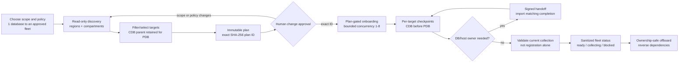
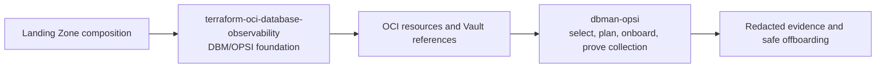

# Fleet Scale and Landing Zone Integration

`dbman-opsi` uses the same reviewed lifecycle for one selected database or a
large fleet. The difference is selection scope, not a different execution
model: answer one questionnaire, produce one immutable plan, review its exact
ID, and execute/resume from one private state store. **One thousand targets is
an acceptance-test example, not a hard product limit.**

## Scale boundary

Local acceptance coverage exercises plans of **1, 100, and 1,000 targets**.
That verifies deterministic discovery/selection, dependency ordering,
checkpointing, resume, status, and zero-action cleanup planning at those sizes.
It is not a claim of a universal OCI quota or live-tenancy throughput guarantee.
Live throughput depends on approved OCI quotas, target/region distribution,
service propagation, administrator handoffs, and the selected bounded
concurrency (1–8).

| Fleet size | Selection pattern | Operator experience |
| --- | --- | --- |
| 1 database | Private `--selection-file` with one target, or narrow filters | One plan, one run ID, the same production gates. |
| 10–100 databases | Region/compartment/kind/tag filters plus exclusions | One reviewed plan and aggregate sanitized status. |
| 1,000-target example plan, or a larger approved fleet | Broad approved filters, `all_discovered: true`, and an intentional concurrency value | The executor checkpoints each independent target; failures do not discard completed work. |

## What the operator selects

The operator does not paste credentials or topology into the plan. A private
`0600` answer file selects the policy; optional private files narrow targets or
supply approved reference bindings.

| Input | Required decision |
| --- | --- |
| `deployment_mode` | `poc`, `demo`, or `production`; production prohibits test DB provisioning and database deletion. |
| `services` | Any target-specific combination of `dbm`, `opsi`, `datasafe`, and `logan`. |
| `discovery_filters` / `--selection-file` | Regions, compartments, kinds, lifecycle state, tags, name, service state, explicit IDs, and exclusions. |
| `credential_policy` | Production default: `shared-user-unique-secret`; Vault references only. |
| `log_preset` | `alert-listener-audit`, `extended`, or `none`. |
| `max_concurrency` | 1–8, chosen to respect OCI throttling and owner capacity. |
| `--bindings` | Private Vault, endpoint, agent, and service references; never plaintext passwords. |

## One workflow, from one DB to a fleet



### Smallest repeatable production run

```bash
# 1. Read-only plan (one selected target or a filtered fleet).
dbman-opsi onboard --region <REGION> \
  --answers fleet-answers.local.yaml \
  --selection-file selected-targets.local.yaml \
  --non-interactive --plan-only --state .fleet-state/fleet.sqlite

# 2. Apply only the exact reviewed plan ID.
dbman-opsi onboard --region <REGION> \
  --answers fleet-answers.local.yaml \
  --selection-file selected-targets.local.yaml \
  --non-interactive --approval <EXACT_PLAN_ID> \
  --state .fleet-state/fleet.sqlite

# 3. Inspect; resume only after remediation or matching signed handoff evidence.
dbman-opsi fleet-status --region <REGION> --run-id <RUN_ID> \
  --state .fleet-state/fleet.sqlite --json
```

Use the same commands at every supported scale. For large fleets, start with a
plan-only run, use explicit exclusions, begin at conservative concurrency, and
review blocked/handed-off targets rather than treating an exit code as evidence
that every selected service is collecting.

## Landing Zone Terraform start point

[`adibirzu/terraform-oci-database-observability`](https://github.com/adibirzu/terraform-oci-database-observability)
is the independent, reusable Terraform module to use when enhancing Landing
Zone composition with declarative Base Database Service and Exadata DBM/OPSI
foundations. It can enable or disable DBM for CDB, PDB, and non-CDB targets,
optionally manage DBM/OPSI private endpoints and Database Insights, accepts
Vault secret references instead of database passwords, and accepts either
literal OCIDs or dependency-map keys.

Use it as the infrastructure foundation; keep this project as the fleet
orchestration and operations plane:



Pin an immutable reviewed Terraform release. The module does not own provider
authentication, Terraform backend, target selection, host/DBA handoffs, or
collection-proof acceptance. Keep those decisions in the calling Landing Zone
root and the `dbman-opsi` fleet plan. Autonomous Database and external-database
lifecycle APIs are intentionally outside that Terraform module's scope.
