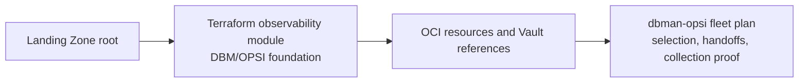

# Scale and Landing Zones

The same `dbman-opsi` lifecycle serves one selected database or a large fleet:
one questionnaire, one immutable plan, one exact approval ID, and one private
checkpoint store. Local acceptance coverage exercises 1, 100, and 1,000 target
plans. **One thousand is an example, not a hard product limit.** It is
orchestration coverage, not a universal OCI quota or live throughput guarantee;
choose concurrency from 1–8 to respect OCI and owner capacity.

## Select only what is approved

- `deployment_mode`: `poc`, `demo`, or `production`.
- `services`: `dbm`, `opsi`, `datasafe`, and/or `logan`.
- `discovery_filters` / `--selection-file`: regions, compartments, kinds,
  lifecycle state, tags, names, service state, explicit IDs, and exclusions.
- `credential_policy`: production defaults to `shared-user-unique-secret` with
  Vault references only.
- `log_preset`: `alert-listener-audit`, `extended`, or `none`.
- `max_concurrency`: 1–8.
- `--bindings`: private approved endpoint, agent, service, and Vault references.

```mermaid
flowchart LR
    A["Choose scope\n1 DB to approved fleet"] --> B["Read-only discovery"]
    B --> C["Filter/select targets\nretain CDB-PDB dependency"]
    C --> D["Immutable plan\nexact ID"]
    D --> E{"Approve?"}
    E -- "exact ID" --> F["Onboard\nbounded concurrency"]
    E -- "change scope" --> B
    F --> G["Checkpoint every target\nCDB before PDB"]
    G --> H["Signed owner handoff\nwhen DB/host work is needed"]
    H --> I["Validate collection\nnot registration alone"]
    I --> J["Sanitized fleet status"]
    J --> K["Ownership-safe offboard"]
```



## Simple run

```bash
dbman-opsi onboard --region <REGION> \
  --answers fleet-answers.local.yaml \
  --selection-file selected-targets.local.yaml \
  --non-interactive --plan-only --state .fleet-state/fleet.sqlite

dbman-opsi onboard --region <REGION> \
  --answers fleet-answers.local.yaml \
  --selection-file selected-targets.local.yaml \
  --non-interactive --approval <EXACT_PLAN_ID> \
  --state .fleet-state/fleet.sqlite
```

For large fleets, review the plan first, set explicit exclusions, start with a
conservative concurrency value, and inspect `blocked`/`handed-off` states rather
than inferring readiness from process success.

## Enhance Landing Zone composition

Use the independent
[`terraform-oci-database-observability`](https://github.com/adibirzu/terraform-oci-database-observability)
module as the declarative Base Database Service and Exadata DBM/OPSI foundation.
It supports CDB, PDB, and non-CDB DBM lifecycle, optional private endpoints and
Database Insights, Vault secret references, and Landing Zone dependency maps.



Pin an immutable reviewed Terraform release. The module leaves provider auth,
state backend, target selection, host/DBA work, and collection-proof acceptance
to the calling root and this operations tool.
